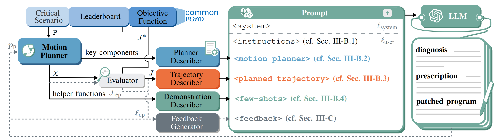

# DrPlanner 🩺: Diagnosis and Repair of Motion Planners Using Large Language Models


## 🔍 Framework Overview



**DrPlanner**: the first framework to autonomously **d**iagnose and **r**epair motion **planner**s 📍, harnessing the power of LLMs that improve as they scale.


## 🌟 Highlights
- **`2024-xx-xx`** Our paper is available on [Arxiv](link-to-be-determined)📄!
- 
## 🚀 Getting Started
### 1. Requirements 📦
For diagnosing your motion planner, we recommend using [Anaconda](https://www.anaconda.com/) to manage your environment 
so that even if you mess something up, you can always have a safe and clean restart. A guide for managing python 
environments with Anaconda can be found [here](https://conda.io/projects/conda/en/latest/user-guide/tasks/manage-environments.html).

```bash
conda create -n drplanner python=3.8 -y
conda activate drplanner
cd <path-to-this-repo>
pip install .
```

### 2. Configuration ⚙️ 

All configurable parameters are located in `config.yaml`.

Before running DrPlanner, set up your `OpenAI API keys`.

Configure as below in `config.yaml`:
```yaml
OPENAI_KEY: # 'sk-xxxxxx'
token_limit: 8000
```

### 3. Running DrPlanner 🩺

Running DrPlanner is straightforward:
```bash
python run_drplanner.py
```

The default settings include the iterative prompting, which you can deactivate in `config.yaml`.

## 🔖 Citation
If you find our paper and codes useful, we highly encourage you to cite our paper:

```bibtex
tbd
```


## 📝 License
tbd