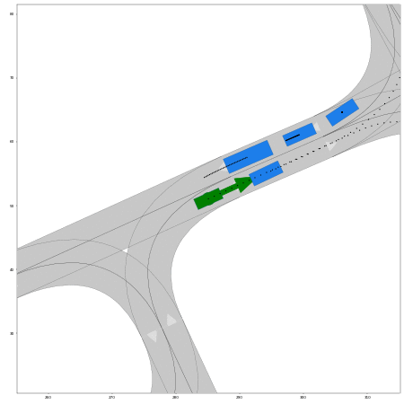

# DrPlanner 🩺: Diagnosis and Repair of Motion Planners Using LLMs

[](https://arxiv.org/abs/2403.07470)
[](https://commonroad.github.io/drplanner/)
[](https://github.com/CommonRoad/drplanner/issues)
## 🔍 Framework Overview


**DrPlanner**: the first framework to autonomously **d**iagnose and **r**epair motion **planner**s 📍, harnessing the power of LLMs that improve as they scale.


## 🌟 Highlights
- **`2024-03-13`** Our paper is available on [Arxiv](https://arxiv.org/abs/2403.07470)📄!

<table style="border-collapse: collapse; border: none;">
  <tr style="border: none;">
    <td align="center"><br>Initial Planner</td>
    <td align="center"><br>First Iteration</td>
    <td align="center"><br>Third Iteration</td>
  </tr>
</table>

## 🚀 Getting Started
### 1. Requirements 📦
For diagnosing your motion planner, we recommend using [Anaconda](https://www.anaconda.com/) to manage your environment 
so that even if you mess something up, you can always have a safe and clean restart. A guide for managing python 
environments with Anaconda can be found [here](https://conda.io/projects/conda/en/latest/user-guide/tasks/manage-environments.html).

#### Clone the repository
```git
git clone <this-repository>
cd <path-to-this-repo>
git submodule init
git submodule update
```

#### Install the package
```bash
conda create -n drplanner python=3.10 -y
conda activate drplanner
pip install . # or poetry install
```

### 2. Configuration ⚙️ 

All configurable parameters are located in `drplanner/utils/config.py`.

Before running DrPlanner, set up your `OpenAI API keys`.

Configure as below:
```
api_key: # 'sk-xxxxxx'
gpt_version: # "gpt4-xxx"
token_limit: 8000
```

### 3. Running DrPlanner 🩺
We use the search-based motion planner, i.e., [commonroad-search](https://gitlab.lrz.de/tum-cps/commonroad-search), to demonstrate the advantages of our framework.
If you wish to replicate this, please consult its README for the installation steps and place your own planner within `drplanner/planners/`. To facilitate a smoother start, we offer the planner used in the paper in this repository.
After this, running DrPlanner is straightforward:
```bash
python run_drplanner.py
```

The default settings include the iterative prompting, which you can deactivate in `config.yaml`.

### 4. Example Prompt 🌠
<details>

> You are an expert in diagnosing motion planners for automated vehicles. Your task is to identify diagnoses and recommend 
prescriptions for the motion planner, with the objective of enhancing its performance.

>Before you start, it is important to understand and adhere to the instructions:
>- Ensure that the improved code is free from errors and that all modifications positively impact the final outcome.
>- Be cautious when adjusting weights or constants, particularly when setting them to zero.
>- When modifying 'if', 'elif', and 'else' constructs, consider that changes may yield variable outcomes across different 
situations.
>- The diagnosis should concisely pinpoint each issue, using only a few words for clarity and brevity. For each 
prescription, provide a detailed, step-by-step action plan.
>- Adhere strictly to all specified instructions. In case of a contradiction with your knowledge, offer a thorough
 explanation.

>The A* search algorithm is employed in trajectory planning to navigate from an initial state to a designated goal 
region by linking motion primitives.This is the code of the heuristic function: 
>```python
>def heuristic_function(self, node_current: PriorityNode) -> float:
>        path_last = node_current.list_paths[-1]
>
>        angleToGoal = self.calc_angle_to_goal(path_last[-1])
>
>        orientationToGoalDiff = self.calc_orientation_diff(angleToGoal, path_last[-1].orientation)
>
>        cost_time = self.calc_time_cost(path_last)
>
>        if self.reached_goal(node_current.list_paths[-1]):
>            heur_time = 0.0
>
>        if self.position_desired is None:
>            heur_time = self.time_desired.start - node_current.list_paths[-1][-1].time_step
>
>        else:
>            velocity = node_current.list_paths[-1][-1].velocity
>
>            if np.isclose(velocity, 0):
>                heur_time = np.inf
>
>            else:
>                heur_time = self.calc_euclidean_distance(current_node=node_current) / velocity
>
>        cost = 20 * orientationToGoalDiff + 0.5 * cost_time + heur_time
>        if cost < 0:
>            cost = 0
>        return cost
>```
> In the current heuristic function of the A* search algorithm, the following functions are called: 
>"calc_angle_to_goal" returns the orientation of the goal (angle in radian, counter-clockwise defined) with respect to 
>the position of the state. "calc_orientation_diff" returns the orientation difference between 2 orientations in 
>radians. "calc_euclidean_distance" cCalculates the euclidean distance of the vehicle center to the desired goal 
>position. "calc_time_cost" Returns time cost (number of time steps) to perform the given path. 
>"reached_goal" returns the goal reaching every state of the path and returns true if one of the state satisfies all 
> conditions for the goal region: position, orientation, velocity, time. 

>  Motion primitives are short trajectories that are drivable by a given vehicle model. By concatenating the primitives,
> a drivable trajectory can be constructed that leads the vehicle from the initial state to the goal state. Generating 
> too sparse primitives (low branching factor) may restrict the search space such that no feasible solution can be 
> found. On the other hand, generating too dense primitives (high branching factor) may dramatically increase the time 
> of search. The currently used motion primitives are named as "V_0.0_20.0_Vstep_4.0_SA_-1.066_1.066_SAstep_0.18_T_0.5_
> Model_BMW_320i.xml",adhering to the format `V_{velocity_min}_{velocity_max}_Vstep_{velocity_step_size}_SA_{steering_angle_min}_{steering_angle_max}_SAstep_{steering_angle_step_size}_T_{time_durantion}_Model_{vehicle_model}`. 
> This name implies the setup of the motion primitives: The velocity range is set from 0.0m/s to 20.0m/s with incremental
> steps of 4.0m/s. The steering angle varies from -1.066 rad to 1.066 rad with a step size of 0.18rad. The motion
> primitives have a fixed duration of 5.0 time steps.

> The objective is to adjust the total cost of the planned trajectory to closely align with the desired value 0.16. 
> The current total cost is calculated to be 4606.93, includes squared sum of acceleration, valued at 91.73 with a 
> weight of 50.0; squared sum of steering angle, valued at 0.09 with a weight of 50.0; squared sum of steering velocity,
> valued at 0.25 with a weight of 50.0; sum of the path length, valued at 0.32 with a weight of 1.0; squared sum of 
> the deviation to the desired velocity, valued at 0.00 with a weight of 20.0; squared sum of the deviation to the 
> desired orientation, valued at 0.06 with a weight of 50.0.

> There are also some pre-defined helper functions can be directly called in the heuristic function:
>```
>def calc_acceleration_cost(self, path: List[KSState]) -> float:
>        """Returns the acceleration costs."""
>```
>```
>def calc_path_efficiency(self, path: List[KSState]) -> float:
>        """Returns the path efficiency = travelled_distance / time_cost."""
>```
>```
>def calc_steering_angle_cost(self, path: List[KSState]) -> float:
>        """Returns steering angle cost of the given path."""
>```
>```
>def calc_steering_velocity_cost(self, path: List[KSState]) -> float:"""
>        """Returns steering velocity cost of the given path."""
>```
>
>Example:
>```
>    def heuristic_function(self, node_current: PriorityNode) -> float:
>
>        if self.reached_goal(path_last):
>            return 0
>        if self.position_desired is None:
>            return ...
>        else:
>            ...
>        # total cost
>        cost = path_efficiency
>        if cost < 0:
>            cost = 0
>        return cost
>```
>Improved result:
>
>Diagnosis: the acceleration is not considered
>Prescription: add acceleration cost to the heuristic function
>Diagnosis: the heuristic should not return 0 when reaching goal region
>Prescription: set a certain heuristic when reaching the goal
>```
>    def heuristic_function(self, node_current: PriorityNode) -> float:
>        acceleration_cost = self.calc_acceleration_cost(path_last)
>        if self.reached_goal(path_last):
>            return path_efficiency + acceleration_cost + ...
>        if self.position_desired is None:
>            return ...
>        else:
>            ...
>        cost = path_efficiency + acceleration_cost
>        if cost < 0:
>            cost = 0
>        return cost
>```

>Feasible motion primitives with the same name format that you can directly use, pls be careful about the name:
>'V_0.0_20.0_Vstep_1.0_SA_-1.066_1.066_SAstep_0.27_T_0.5_Model_BMW_320i.xml',
>'V_0.0_20.0_Vstep_1.0_SA_-1.066_1.066_SAstep_2.13_T_0.5_Model_BMW_320i.xml',
>'V_0.0_20.0_Vstep_2.0_SA_-1.066_1.066_SAstep_0.18_T_0.5_Model_BMW_320i.xml',
>'V_0.0_20.0_Vstep_2.22_SA_-1.066_1.066_SAstep_0.18_T_0.5_Model_BMW_320i.xml',
>'V_0.0_20.0_Vstep_2.86_SA_-1.066_1.066_SAstep_0.18_T_0.5_Model_BMW_320i.xml',
>'V_0.0_20.0_Vstep_3.33_SA_-1.066_1.066_SAstep_0.18_T_0.5_Model_BMW_320i.xml',
>'V_0.0_20.0_Vstep_4.0_SA_-1.066_1.066_SAstep_0.18_T_0.5_Model_BMW_320i.xml'
 
</details>


## 🔖 Citation
If you find our paper and codes useful, we highly encourage you to cite our paper:

```bibtex
@article{DrPlanner,
  title = {{DrPlanner}: Diagnosis and Repair of Motion Planners Using Large Language Models },
  author = {Yuanfei Lin and Chenran Li and Mingyu Ding and Masayoshi Tomizuka and Wei Zhan and Matthias Althoff},
  archivePrefix = {arXiv},
  journal = {arXiv preprint arXiv:2403.07470},
  year = {2024}}
```


## 📝 License
BSD 3-Clause License